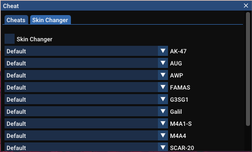

<h1  align="center">
  EZGE (EZ Global Elite)
</h1>

External Counter-Strike: Global Offensive cheat, written in C++

  </img>
  </img> 

## Description

An external **_Counter-Strike: Global Offensive_** cheat, written in C++. This project was built as an exercise for learning reverse engineering.
 
**Disclaimer**: Since this project was not intended for actual use in multiplayer games and I advise againts cheating in games, **USE IT AT YOUR OWN RISK, YOU MIGHT GET BANNED.**

## Features:
- Aimbot + smoothness of snapping to target
- Glow
- Radar
- Bunnyhop
- No flashbang
- Skin changer

## Build project
Download the project and build it with Visual Studio 2022 (preferably the latest edition)
